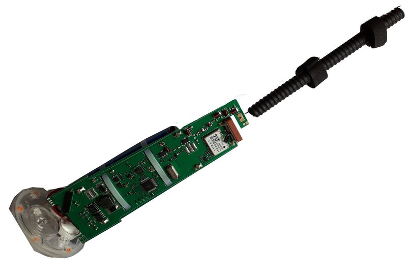
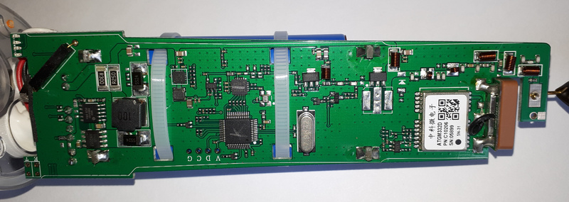
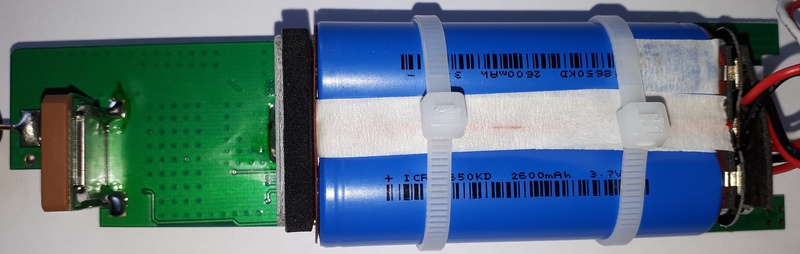
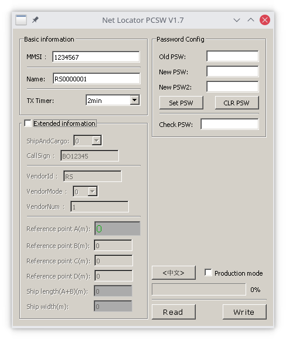

# RS-109M AIS Net Locator AIS buoy

This repo is contains a [config tool](rs109m.py) and some info about the [RS-109M](https://opcenter.de/pub/Boot/RS_109M_manual.pdf) Net Locator AIS buoy.

The device is sold by [Socotron](http://web.archive.org/web/20210806132018/https://socotran.com/products/fishing-net-tracker-locator-gps-marine-ais-netsonde-net-sonde-for-boating-rs-109m) and is also available on Ali\*xpress and e\*ay. In the UK, it is also sold by [East Anglian Radio](http://web.archive.org/web/20210806152420/https://www.eastanglianradio.com/rs-109-ais.html).

[](images/buoy.jpg)

Information was gathered by personal observations like photographs of the PCB, and logging of the data stream while configuring.

## Attention

It is questionable if this device could be operated as a proper ("valid", "legal") AIS device!

Take appropriate measures when trying out things (e.g. shield RF, dummy load).

See [FCC statement](http://web.archive.org/web/20210806152632/https://docs.fcc.gov/public/attachments/DA-18-1211A1_Rcd.pdf) concerning the ban of fishing net buoys that use radio frequencies reserved for marine navigation safety.

## rs109m.py

[rs109m.py](rs109m.py) is a configuration tool written in Python 3.


```
usage: rs109m.py [-h] [-d DEVICE] [-m MMSI] [-n NAME] [-i INTERVAL] [-t TYPE] [-c CALLSIGN] [-v VENDORID] [-u UNITMODEL] [-s SERNUM] [-A REFA] [-B REFB] [-C REFC]
                 [-D REFD] [-P PASSWORD] [-E] [-W] [-R]

RS-109M Net Locator AIS buoy configurator

optional arguments:
  -h, --help            show this help message and exit
  -d DEVICE, --device DEVICE
                        serial port device (e.g. /dev/ttyUSB0)
  -m MMSI, --mmsi MMSI  MMSI
  -n NAME, --name NAME  ship name
  -i INTERVAL, --interval INTERVAL
                        transmit interval in s [30..600]
  -t TYPE, --type TYPE  ship type, eg sail=36, pleasure craft=37
  -c CALLSIGN, --callsign CALLSIGN
                        call sign
  -v VENDORID, --vendorid VENDORID
                        AIS unit vendor id (3 characters)
  -u UNITMODEL, --unitmodel UNITMODEL
                        AIS unit vendor model code
  -s SERNUM, --sernum SERNUM
                        AIS unit serial num
  -A REFA, --refa REFA  Reference A (distance AIS to bow (m); Net Locator sends battery voltage instead)
  -B REFB, --refb REFB  Reference B (distance AIS to stern (m)
  -C REFC, --refc REFC  Reference C (distance AIS toi port (m)
  -D REFD, --refd REFD  Reference D (distance AIS to starboard (m)
  -P PASSWORD, --password PASSWORD
                        password to access Net Locator
  -E, --extended        operate on 0xff size config instead of default 0x40
  -W, --write           write config to Net Locator
  -R, --noread          do not read from Net Locator

```
## Internals

Unscrewing the cap gives access to on/off switch (a magnet which acts on a reed relais) and the charging and programming connectors:

[](images/buoy_connectors.jpg)

The PCB in all its glory:

[](images/pcb_complete.jpg)

[](images/pcb_front.jpg)

[](images/pcb_back.jpg)


## Manufacturer's PCSW 1.7 software

The software is available upon request from the dealer.
It is a Qt application compiled for Windows. I could get it to start with Wine 6.14 on Linux (Linux 5.12.15-arch1-1 x86_64, ArchLinux distribution), but had no chance to get the serial communications running.



Using the software on a Windows VM, I was able to produce some [logs](logs/) to get knowledge of the serial protocol.

"Production mode" seems to do nothing more than incrementing MMSI number on subsequent writes.

## Configuration protocol

See [logs dir](logs/) for data I obtained while doing tiny configuration changes.

The protocol is via serial 115200,8n1.

Device expects an init sequence with a password. This password is a weak protection, as it defaults to 000000 and is in the range of 0..999999.
It seems that the password protection can be bypassed by supplying a zero-length password init sequence.

Initialisation has to take place in the first few seconds after power-up.

After init, you can do 3 things:
 * read config
 * write config
 * set/clear password

Config is done as a whole block of data with some values weirdly stuffed together to save some space.

Original software always reads/writes 0x40 bytes, but there is possibility to access 0xff bytes.

When supplying an "update" command without actually delivering any data, there seems to be a glitch leading to contents from an unknown memory region being stored in config space.
This can be restored by simply copying default memory contents (0xff length) again.

## Hardware

Buoy is built around Si4463 radio.

Microprocessor matches the layout of ubiquitous STM32F103C8, but as it has no markings, it could as well be a clone or different STM32 ARM µC.
A SWDIO debug port is available on the PCB (marked G=ground, C=clock, D=swdio, V=VCC), but did not check.

GPS module is ATGM332D with GPS and BDS/BeiDou support, but no GLONASS. It seems to be tied only with its TX pin to an RX pin of the µC.

See [MAIANA AIS project](https://github.com/peterantypas/maiana) for a far more capable Open Source board.
